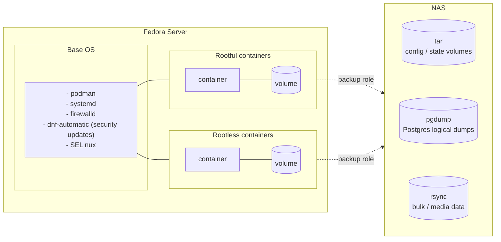

# Home Server Installation & Automation

## Objective

The objective of this project is to design and operate a **reliable, reproducible, and fully automated home server platform** that minimizes manual intervention, simplifies maintenance, and provides a solid foundation for containerized workloads.

The solution emphasizes:

- **Application focus**
  - Provide a secure, private (ad- and tracker-filtered) home network environment for all family members
  - Host and own all personal data — documents, music, photos, videos
  - Seamless integration with the iOS ecosystem wherever practical (AirPlay, native photo sync, etc.)
- **Automation by default**
  - Fully automatic installation driven by Ansible
  - Private overlay repository holds all host-specific configuration
- **Security-conscious design**
  - Unique credentials generated during initial install
  - Private repository for home-server-specific configuration
  - Secrets stored encrypted with `ansible-vault`
  - Rootless containers first — each rootless application runs as its own dedicated Linux user
  - Rootful containers only where rootless is not feasible, and always hardened
- **Operational consistency**
  - Fully automatic reinstall from scratch, including restore of configuration and data
  - Simple but practical backup and restore of all your data

---

## Target Architecture

The target system is built around a small number of well-defined components that together provide a predictable and maintainable platform.



---

### 1. Base Operating System – Fedora Server

Fedora Server is used as the foundational operating system due to:
- A modern kernel and container tooling
- Strong SELinux integration
- Alignment with RHEL-like operational models
- A predictable lifecycle and update process

This choice ensures the system remains **secure, current, and aligned with enterprise Linux best practices**, while still being suitable for home use.

---

### 2. Configuration Management – Ansible

All post-installation configuration is handled using **Ansible**, ensuring the system converges into a known desired state.

Ansible is responsible for:
- System configuration and hardening
- User and group management
- Container runtime setup
- Service configuration and lifecycle management

This approach treats the system as **infrastructure as code**, enabling version control, review, and repeatable execution.

---

### 3. Container-First Workload Model

All applications and services are deployed as containers using two complementary execution models.

#### Rootful Containers
Used for:
- Infrastructure-level services
- Networking-sensitive workloads
- Services requiring elevated privileges

#### Rootless Containers
Used for:
- User-scoped services
- Isolated application stacks
- Improved security through least-privilege execution

Each container deployment is:
- Fully automated via Ansible
- Declarative and reproducible
- Independent of manual user interaction

Persistent data is stored in explicitly defined volumes, allowing:
- Clean separation between OS and application data
- Straightforward backup and restore processes

---

## Non-Goals

The following items are explicitly **out of scope** for this project:

- Running a general-purpose desktop environment on the server
- Manual, ad-hoc configuration changes on the host system
- Hosting production-grade, high-availability workloads
- Complex multi-node orchestration platforms (e.g. Kubernetes)
- Cloud-specific tooling or managed services dependencies
- Long-term in-place OS upgrades without reprovisioning

The guiding principle is **rebuild over repair**: if the system drifts, it should be reinstalled and redeployed automatically rather than manually fixed.

---

## Getting Started

### Repository structure

This repo is designed to be used alongside a **private overlay** that holds
your personal inventory (host IPs, vault-encrypted secrets, device configs).
The public repo contains all roles, playbooks, and example configs — but no
real credentials or personal data.

```
~/github/
  home-server/              ← this public repo (clone it)
  home-server-private/      ← your private overlay (create or clone)
    inventory/
      hosts.yml             ← your real host definitions
      host_vars/
        homeserver.yml      ← your vault-encrypted secrets + overrides
    roles/
      syncthing/            ← personal syncthing device identity (optional)
        files/volumes/syncthing-config/config/
          cert.pem
          key.pem
        templates/volumes/syncthing-config/config/
          config.xml.j2
```

### 1. Set up the private overlay

**Option A — Start fresh** (no existing private repo):

```bash
mkdir -p home-server-private/inventory/host_vars
cp home-server/inventory/hosts.yml.example home-server-private/inventory/hosts.yml
cp home-server/inventory/host_vars/homeserver.yml.example home-server-private/inventory/host_vars/homeserver.yml
```

Edit both files with your real values.

**Option B — Clone existing** (if you already have a private repo):

```bash
git clone git@github.com:youruser/home-server-private.git
```

### 2. Symlink private files into the public repo

```bash
cd home-server
ln -sf ../home-server-private/inventory/hosts.yml inventory/hosts.yml
ln -sf ../home-server-private/inventory/host_vars/homeserver.yml inventory/host_vars/homeserver.yml
```

These symlinks are gitignored — they won't leak into the public repo.

For syncthing config restore (optional):

```bash
mkdir -p roles/syncthing/files/volumes/syncthing-config/config
mkdir -p roles/syncthing/templates/volumes/syncthing-config/config
ln -sf ../../../../../../../../home-server-private/roles/syncthing/files/volumes/syncthing-config/config/key.pem roles/syncthing/files/volumes/syncthing-config/config/key.pem
ln -sf ../../../../../../../../home-server-private/roles/syncthing/files/volumes/syncthing-config/config/cert.pem roles/syncthing/files/volumes/syncthing-config/config/cert.pem
ln -sf ../../../../../../../../home-server-private/roles/syncthing/templates/volumes/syncthing-config/config/config.xml.j2 roles/syncthing/templates/volumes/syncthing-config/config/config.xml.j2
```

### 3. Generate and encrypt secrets

```bash
# Create a vault password file (gitignored)
echo 'your-vault-password' > vault.pw

# Generate and encrypt a secret
openssl rand -base64 24 | ansible-vault encrypt_string --stdin-name 'pihole_api_password'
```

Paste the output into your private `inventory/host_vars/homeserver.yml`.

### 4. Install role dependencies

```bash
ansible-galaxy install -r roles/requirements.yml -p .ansible/roles/
```

### 5. Deploy a service

```bash
ansible-playbook playbooks/pihole.yml
```

## Services

### Deployed

| Service | Purpose | Container images | Volumes (backup method) |
|---|---|---|---|
| **Dashboard** | Static status page served by Caddy, showing all deployed services and their volumes. | — (static HTML rendered on host) | — |
| **Caddy** | Front-door reverse proxy with internal TLS via a private CA. | `caddy:latest` | `caddy-data`, `caddy-config`, `caddy-etc` (not backed up — regenerated from role) |
| **Pi-hole + Unbound** | Network-wide DNS ad/tracker blocking with a local recursive resolver (no upstream DNS leakage). HTTPS admin UI on port 8443. | `pi-hole/pihole:latest`, `klutchell/unbound:latest` | `pihole-etc` (tar), `pihole-dnsmasq` (tar) |
| **Shairport-sync** | AirPlay audio receiver for iOS/macOS devices. | `mikebrady/shairport-sync` | — (stateless) |
| **Syncthing** | Peer-to-peer file synchronization between household devices. | `syncthing/syncthing:2` | `syncthing-config` (tar), `syncthing-data` (rsync) |
| **Jukebox** (Lyrion Music Server + Squeezelite) | Self-hosted music server with streaming client, Material skin UI. | `lmscommunity/lyrionmusicserver`, `giof71/squeezelite` | `jukebox-server-config` (tar), `jukebox-server-playlist` (tar), `jukebox-server-music` (rsync, opt-in restore) |
| **Ente Photos** | Self-hosted photo & video library with iOS/Android apps (end-to-end encrypted). | `ente-io/server:latest`, `ente-io/web:latest`, `postgres:15`, `minio/minio:latest` | `entephoto-museum-config` (tar), `entephoto-minio-data` (rsync), `ente_db` Postgres (pgdump) |
| **Paperless-NGX** | Document management with OCR + full-text search. Includes an SFTP sidecar for scanner auto-ingest. | `paperless-ngx/paperless-ngx:latest`, `postgres:16`, `redis:7-alpine`, `gotenberg/gotenberg:8`, `atmoz/sftp:latest` | `paperless-data` (tar), `paperless-export` (tar), `paperless-redis-data` (tar), `paperless-media` (rsync), `paperless` Postgres (pgdump); `paperless-consume`, `paperless-sftp-*` are working/runtime volumes (not backed up) |
| **Jellyfin** | Media server for movies, TV and music with native iOS/tvOS clients. | `jellyfin/jellyfin:latest` | `jellyfin-config` (tar), `jellyfin-media` (rsync, opt-in restore); `jellyfin-cache` is regenerated |
| **Backup** | Snapshots each role's declared volumes to the NAS on a schedule; retention per method. | — (host service, no container) | — |

Backup flavours (driven by each role's `backup_manifest`):
- **tar** — small config/state volumes, restored atomically.
- **pgdump** — logical SQL dumps for PostgreSQL services (container stays up).
- **rsync** — large mutable trees where a full-volume tar would be wasteful (media, bulk data).

### Planned
- Nextcloud (file storage and sharing)
- IoT stack (Mosquitto, InfluxDB, Grafana, Telegraf)
- Uptime Kuma
- Home Assistant
- Mealie
