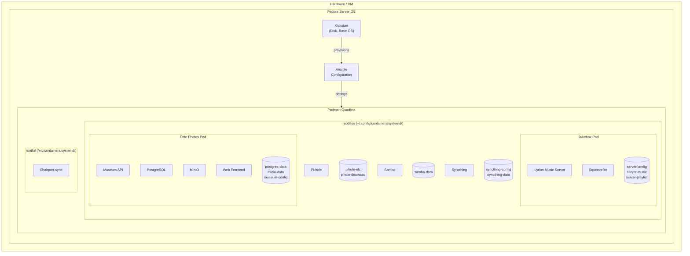

# Home Server Installation & Automation

## Objective

The objective of this project is to design and operate a **reliable, reproducible, and fully automated home server platform** that minimizes manual intervention, simplifies maintenance, and provides a solid foundation for containerized workloads.

The solution emphasizes:
- Automation by default
- Security-conscious design
- Operational consistency
- Ease of recovery and reinstallation

---

## Target Architecture

The target system is built around a small number of well-defined components that together provide a predictable and maintainable platform.

---

### 1. Base Operating System – Fedora Server

Fedora Server is used as the foundational operating system due to:
- A modern kernel and container tooling
- Strong SELinux integration
- Alignment with RHEL-like operational models
- A predictable lifecycle and update process

This choice ensures the system remains **secure, current, and aligned with enterprise Linux best practices**, while still being suitable for home use.

---

### 2. Automated OS Installation – Kickstart

The operating system installation is fully automated using **Kickstart**.

Primary goals:
- Zero-touch installation
- Deterministic disk layout and filesystem structure
- No manual steps during OS deployment
- Fast reinstallation and disaster recovery

Kickstart defines:
- Disk partitioning and LVM layout
- Base package selection
- Network configuration
- Initial system configuration and defaults

This allows the server to be **reprovisioned at any time in a predictable and repeatable way**.

---

### 3. Configuration Management – Ansible

All post-installation configuration is handled using **Ansible**, ensuring the system converges into a known desired state.

Ansible is responsible for:
- System configuration and hardening
- User and group management
- Container runtime setup
- Service configuration and lifecycle management

This approach treats the system as **infrastructure as code**, enabling version control, review, and repeatable execution.

---

### 4. Container-First Workload Model

All applications and services are deployed as containers using two complementary execution models.

#### Rootful Containers
Used for:
- Infrastructure-level services
- Networking-sensitive workloads
- Services requiring elevated privileges

#### Rootless Containers
Used for:
- User-scoped services
- Isolated application stacks
- Improved security through least-privilege execution

Each container deployment is:
- Fully automated via Ansible
- Declarative and reproducible
- Independent of manual user interaction

Persistent data is stored in explicitly defined volumes, allowing:
- Clean separation between OS and application data
- Straightforward backup and restore processes

---

## Non-Goals

The following items are explicitly **out of scope** for this project:

- Running a general-purpose desktop environment on the server
- Manual, ad-hoc configuration changes on the host system
- Hosting production-grade, high-availability workloads
- Complex multi-node orchestration platforms (e.g. Kubernetes)
- Cloud-specific tooling or managed services dependencies
- Long-term in-place OS upgrades without reprovisioning

The guiding principle is **rebuild over repair**: if the system drifts, it should be reinstalled and redeployed automatically rather than manually fixed.

---

## High-Level Architecture Diagram



## Getting Started

### Repository structure

This repo is designed to be used alongside a **private overlay** that holds
your personal inventory (host IPs, vault-encrypted secrets, device configs).
The public repo contains all roles, playbooks, and example configs — but no
real credentials or personal data.

```
~/github/
  home-server/              ← this public repo (clone it)
  home-server-private/      ← your private overlay (create or clone)
    inventory/
      hosts.yml             ← your real host definitions
      host_vars/
        homeserver.yml      ← your vault-encrypted secrets + overrides
    roles/
      syncthing/            ← personal syncthing device identity (optional)
        files/volumes/syncthing-config/config/
          cert.pem
          key.pem
        templates/volumes/syncthing-config/config/
          config.xml.j2
```

### 1. Set up the private overlay

**Option A — Start fresh** (no existing private repo):

```bash
mkdir -p home-server-private/inventory/host_vars
cp home-server/inventory/hosts.yml.example home-server-private/inventory/hosts.yml
cp home-server/inventory/host_vars/homeserver.yml.example home-server-private/inventory/host_vars/homeserver.yml
```

Edit both files with your real values.

**Option B — Clone existing** (if you already have a private repo):

```bash
git clone git@github.com:youruser/home-server-private.git
```

### 2. Symlink private files into the public repo

```bash
cd home-server
ln -sf ../home-server-private/inventory/hosts.yml inventory/hosts.yml
ln -sf ../home-server-private/inventory/host_vars/homeserver.yml inventory/host_vars/homeserver.yml
```

These symlinks are gitignored — they won't leak into the public repo.

For syncthing config restore (optional):

```bash
mkdir -p roles/syncthing/files/volumes/syncthing-config/config
mkdir -p roles/syncthing/templates/volumes/syncthing-config/config
ln -sf ../../../../../../../../home-server-private/roles/syncthing/files/volumes/syncthing-config/config/key.pem roles/syncthing/files/volumes/syncthing-config/config/key.pem
ln -sf ../../../../../../../../home-server-private/roles/syncthing/files/volumes/syncthing-config/config/cert.pem roles/syncthing/files/volumes/syncthing-config/config/cert.pem
ln -sf ../../../../../../../../home-server-private/roles/syncthing/templates/volumes/syncthing-config/config/config.xml.j2 roles/syncthing/templates/volumes/syncthing-config/config/config.xml.j2
```

### 3. Generate and encrypt secrets

```bash
# Create a vault password file (gitignored)
echo 'your-vault-password' > vault.pw

# Generate and encrypt a secret
openssl rand -base64 24 | ansible-vault encrypt_string --stdin-name 'pihole_api_password'
```

Paste the output into your private `inventory/host_vars/homeserver.yml`.

### 4. Install role dependencies

```bash
ansible-galaxy install -r roles/requirements.yml -p .ansible/roles/
```

### 5. Deploy a service

```bash
ansible-playbook playbooks/pihole.yml
```

## Services

### Deployed
- Shairport-sync (AirPlay audio server)
- Pi-hole (DNS ad blocker, HTTPS on port 8443)
- Samba (guest-accessible exchange folder)
- Syncthing (file synchronization with config restore)
- Lyrion Music Server / Squeezelite (Jukebox with Material Skin)
- Ente Photos (self-hosted photo storage with PostgreSQL + MinIO)

### Planned
- Paperless NGX
- IoT stack (Mosquitto, InfluxDB, Grafana, Telegraf)
- Uptime Kuma
- Home Assistant
- Mealie
- Kopia (backup)
