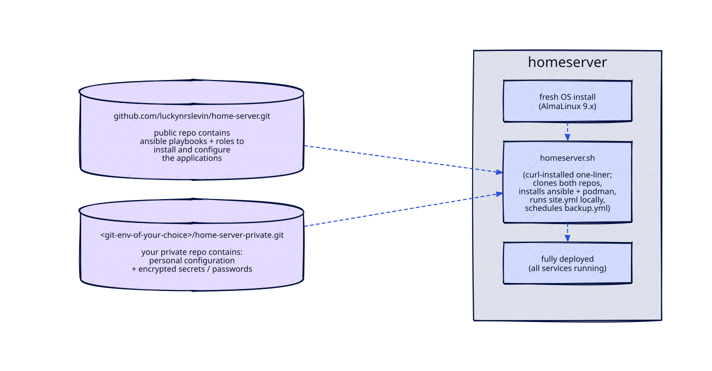
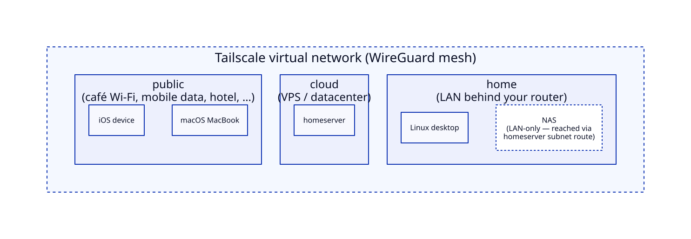

# Accelerate your journey to privacy and owning your data <br>Build your own private ecosystem.

## Objective

There are plenty of homeserver projects already. Why another one?

Because **the tools aren't the bottleneck — the transition is.**

Anyone who's tried to move off a vendor ecosystem (iCloud, Google
Photos, Apple Music, Dropbox, …) knows the pattern: dozens of viable
self-hosted alternatives in every category, each with its own setup,
backup shape, sync quirks, and migration story. Evaluating them takes
hours per app. Wiring half a dozen into a single coherent, daily-use
system takes weeks. Most people give up partway through and stay
locked in.

And to be fair: ecosystems like Apple's are genuinely good at "it
just works." That's why the *cost of leaving* feels so high — and why
the *cost of staying* (no real ownership of your own data, no leverage
when terms change) stays mostly invisible until it bites.

This project is one opinionated, end-to-end answer: a small,
well-chosen stack of self-hosted applications deployed together by a
single fully-automated install, with backup, restore, TLS, and a
unified dashboard already plumbed in. No "now wire these seven things
together yourself" steps.

**Today's audience.** Two groups, served by the same opinionated
stack:
- Technically inclined people who want real privacy and real control
  over their data, willing to spend a weekend (rather than a quarter)
  on the transition.
- Users who want to make the move, don't have the skills themselves,
  but are willing to pay a reasonable fee to an IT-services provider
  to deliver the same outcome.

**Where it's going.**
- Long-term, the IT-services role should be
  absorbable by an AI agent — guiding non-technical users through
  the move end-to-end and handing back a working setup. Today the
  human is in the loop; tomorrow the agent is.
- And obviously besides home users it could also serve the transition for
  small businesses, e.g. having the need to move away due to GDPR / US 
  cloud act or simply not satisfied with ecosystems like Office 365 and 
  looking for alternatives.

### Design principles

What "opinionated, end-to-end" means concretely:

- **Application focus**
  - A secure, private (ad- and tracker-filtered) home network for all family members
  - Host and own all personal data — documents, music, photos, videos
  - Seamless integration with the iOS ecosystem wherever practical (AirPlay, native photo sync, etc.)
- **Automation by default**
  - Fully automatic, declarative installation — one command, no clicking through wizards
  - Per-host configuration kept in a private overlay repository
- **Security-conscious design**
  - Unique credentials generated during initial install
  - Secrets stored encrypted at rest, never committed in plaintext
  - Rootless containers first — each rootless application runs as its own dedicated Linux user
  - Rootful containers only where rootless is not feasible, and always hardened
  - Caddy is the mandatory front door — every web UI reached via `https://<subdomain>.<caddy_domain>` with a single trusted internal CA; per-service HTTP ports are not exposed on the LAN
  - Use tailscale to create a virtual network accross your devices to be able to access services on your homeserver independent from your location and network access point
- **Operational consistency**
  - Fully automatic reinstall from scratch, including restore of configuration and data
  - All applications fully integrated with systemd (start, stop, reboot)
  - Simple but practical backup and restore of all your data
  - Automatic release updates of containers, plus automatic OS security updates on the host

---

## Alternatives & Comparison

There are plenty of self-hosting tools out there. The table below is
an honest, side-by-side look at where each one shines and where it
leaves work on your plate compared to this project's "opinionated
end-to-end" model. Contributions welcome — open an issue or PR if
your favourite solution is missing.

| Solution | Strengths (vs. this project) | Gaps (vs. this project) |
|---|---|---|
| **[Coolify](https://coolify.io)** — open-source PaaS-style controller with a UI for deploying self-hosted services. | • Polished web UI for browsing and configuring services.<br>• Large library of preconfigured application templates.<br>• Several hosting providers offer ready-made Coolify VPS images — quick to spin up for evaluation.<br>• Good fit for *trying out* candidate applications before committing. | • Not actually one-click — non-trivial apps still need per-application config and container-level digging.<br>• Coolify itself runs on your server and consumes RAM/CPU that small home boxes (4–8 GB RAM mini-PC) can't really spare.<br>• Coolify runs as **root** and so do all deployed containers — full rootless Docker is an open [feature request](https://github.com/coollabsio/coolify/issues/2387), not a shipped feature. The Jan 2026 CVE batch (3× CVSS 10.0, including unauthenticated root SSH key disclosure) shows the cost of that default.<br>• Container lifecycle is just Docker restart policies (`unless-stopped` etc.) — no per-app systemd unit, no dependency ordering (e.g. wait for NFS mount before starting Jellyfin), no `systemctl status <app>` / `journalctl -u <app>`. Coolify's own control plane has had host-reboot problems ([issue #5933](https://github.com/coollabsio/coolify/issues/5933)).<br>• No automatic container release updates, no automatic OS security updates — you're on the patch treadmill.<br>• No built-in backup/restore workflow — assemble it yourself per service. |

---

## Technical Architecture

The target system is built around a small number of well-defined
components that together provide a predictable and maintainable
platform. It leverages **podman containers** (both rootless and
rootful) and **podman quadlets** for native systemd integration —
every application is wired into the host's boot and shutdown
sequence, scheduled container updates, and the backup flow.



<!-- Source: docs/diagrams/technical.d2 — render with `d2 docs/diagrams/technical.d2 docs/diagrams/technical.svg` -->


The same system from an **automation perspective** — who does what,
and in which order, to bring a fresh box up to a fully-deployed
homeserver. The laptop as ansible host is optional, you could also use the homeserver itself:



<!-- Source: docs/diagrams/automation.d2 — render with `d2 docs/diagrams/automation.d2 docs/diagrams/automation.svg` -->


Use **Tailscale** to create a **virtual network across your devices and the homeserver** to be able to access the services running on homeserver, independent from the location and network access point your device is connected. NAS server can be omittet but still needs network access to the homeserver for backup und restore operations.



<!-- Source: docs/diagrams/tailscale.d2 — render with `d2 docs/diagrams/tailscale.d2 docs/diagrams/tailscale.svg` -->


---

### 1. Base Operating System – AlmaLinux 9

AlmaLinux 9 is used as the foundational operating system due to:
- A long, predictable lifecycle (10 years per major release)
  with no surprise feature churn between minor versions
- Bug-for-bug compatibility with RHEL — every operational pattern,
  package, and SELinux policy translates directly
- Strong SELinux integration out of the box
- Mature container tooling — **podman ≥ 5** with native systemd
  **quadlet** unit support and rootless containers, shipped in stock
  `appstream` from AL 9.4 onward (no third-party COPR required)
- **nfs-utils** in stock `baseos` — every host gets the
  `mount.nfs` helper needed for the NAS-backed media (jellyfin) and
  backup/restore flows
- Free and community-governed, with no commercial subscription
  required

This choice ensures the system remains **secure, current, and aligned
with enterprise Linux best practices**, while still being suitable for
home use — and avoids the ~13-month Fedora release treadmill on a
machine that should "just work" for years.

---

### 2. Configuration Management – Ansible

All post-installation configuration is handled using **Ansible**, ensuring the system converges into a known desired state.

Ansible is responsible for:
- System configuration and hardening
- User and group management
- Container runtime setup
- Service configuration and lifecycle management

This approach treats the system as **infrastructure as code**, enabling version control, review, and repeatable execution.

---

### 3. Container-First Workload Model

All applications and services are deployed as containers using two complementary execution models.

#### Rootful Containers
Used for:
- Infrastructure-level services
- Networking-sensitive workloads
- Services requiring elevated privileges

#### Rootless Containers
Used for:
- User-scoped services
- Isolated application stacks
- Improved security through least-privilege execution

Each container deployment is:
- Fully automated via Ansible
- Declarative and reproducible
- Independent of manual user interaction

Persistent data is stored in explicitly defined volumes, allowing:
- Clean separation between OS and application data
- Straightforward backup and restore processes

---

## Non-Goals

The following items are explicitly **out of scope** for this project:

- Running a general-purpose desktop environment on the server
- Manual, ad-hoc configuration changes on the host system
- Hosting production-grade, high-availability workloads
- Complex multi-node orchestration platforms (e.g. Kubernetes)
- Cloud-specific tooling or managed services dependencies
- Long-term in-place OS upgrades without reprovisioning

The guiding principle is **rebuild over repair**: if the system drifts, it should be reinstalled and redeployed automatically rather than manually fixed.

---

## Getting Started

### Network prerequisites

Several roles assume specific LAN IPs are stable: `backup_nas_ip`
pins the NAS IP into `/etc/hosts`, `pihole_local_dns_records` map
hostnames to per-host IPs, and any service the dashboard links to
sits at the home-server's address. None of this survives DHCP lease
drift.

**Pin each device's IP via a router-side DHCP reservation** (admin
UI → DHCP → "Address reservation" / "Static lease" — exact menu
varies by vendor). Bind each device's MAC to the IP it currently
holds. Two devices need this:

- **The home server** — IP referenced as `caddy_domain`'s
  resolution target and as the host every Caddy reverse-proxy
  hostname points at.
- **The NAS** (if you back up to one) — IP referenced as
  `backup_nas_ip` in the backup role.

The host stays on DHCP; the router always answers with the same
address. Single source of truth, survives NIC swaps. If you'd
rather not use your router for this, Pi-hole can also act as the
DHCP server; the project doesn't require it either way.

Without reservations, lease drift will eventually break backups,
Pi-hole local DNS, and any service that hardcodes a LAN IP.

### Repository structure

This repo is designed to be used alongside a **private overlay** that holds
your personal inventory (host IPs, vault-encrypted secrets, device configs).
The public repo contains all roles, playbooks, and example configs — but no
real credentials or personal data.

```
~/github/
  home-server/              ← this public repo (clone it)
  home-server-private/      ← your private overlay (create or clone)
    inventory/
      hosts.yml             ← your real host definitions
      host_vars/
        homeserver.yml      ← your vault-encrypted secrets + overrides
    roles/
      syncthing/            ← personal syncthing device identity (optional)
        files/volumes/syncthing-config/config/
          cert.pem
          key.pem
        templates/volumes/syncthing-config/config/
          config.xml.j2
```

### 1. Set up the private overlay

**Option A — Start fresh** (no existing private repo):

```bash
mkdir -p home-server-private/inventory/host_vars
cp home-server/inventory/hosts.yml.example home-server-private/inventory/hosts.yml
cp home-server/inventory/host_vars/homeserver.yml.example home-server-private/inventory/host_vars/homeserver.yml
```

Edit both files with your real values.

**Option B — Clone existing** (if you already have a private repo):

```bash
git clone git@github.com:youruser/home-server-private.git
```

### 2. Symlink private files into the public repo

```bash
cd home-server
ln -sf ../home-server-private/inventory/hosts.yml inventory/hosts.yml
ln -sf ../home-server-private/inventory/host_vars/homeserver.yml inventory/host_vars/homeserver.yml
```

These symlinks are gitignored — they won't leak into the public repo.

For syncthing config restore (optional):

```bash
mkdir -p roles/syncthing/files/volumes/syncthing-config/config
mkdir -p roles/syncthing/templates/volumes/syncthing-config/config
ln -sf ../../../../../../../../home-server-private/roles/syncthing/files/volumes/syncthing-config/config/key.pem roles/syncthing/files/volumes/syncthing-config/config/key.pem
ln -sf ../../../../../../../../home-server-private/roles/syncthing/files/volumes/syncthing-config/config/cert.pem roles/syncthing/files/volumes/syncthing-config/config/cert.pem
ln -sf ../../../../../../../../home-server-private/roles/syncthing/templates/volumes/syncthing-config/config/config.xml.j2 roles/syncthing/templates/volumes/syncthing-config/config/config.xml.j2
```

### 3. Generate and encrypt secrets

```bash
# Create a vault password file (gitignored)
echo 'your-vault-password' > vault.pw

# Generate and encrypt a secret
openssl rand -base64 24 | ansible-vault encrypt_string --stdin-name 'pihole_api_password'
```

Paste the output into your private `inventory/host_vars/homeserver.yml`.

### 4. Install role dependencies

```bash
ansible-galaxy install -r roles/requirements.yml -p .ansible/roles/
```

### 5. Deploy a service

```bash
ansible-playbook playbooks/pihole.yml
```

## Services

### Deployed

| Service | Purpose | Container images | Volumes (backup method) |
|---|---|---|---|
| **Dashboard** | Regularly updated Dashboard, showing all deployed services incl. status, related volumes and backup status. | — (static HTML rendered on host) | — |
| **Caddy** | Front-door reverse proxy with internal TLS via a private CA. | `caddy:latest` | <ul><li>`caddy-data` — internal CA seeded from private overlay (not backed up)</li><li>`caddy-config` — not backed up</li><li>`caddy-etc` — not backed up</li></ul> |
| **Pi-hole + Unbound** | Network-wide DNS ad/tracker blocking with a local recursive resolver (no upstream DNS leakage). HTTPS admin UI on port 8443. | <ul><li>`pi-hole/pihole:latest`</li><li>`klutchell/unbound:latest`</li></ul> | <ul><li>`pihole-etc` — tar</li><li>`pihole-dnsmasq` — tar</li></ul> |
| **Shairport-sync** | AirPlay audio receiver for iOS/macOS devices. | `mikebrady/shairport-sync` | — (stateless) |
| **Syncthing** | Peer-to-peer file synchronization between household devices. | `syncthing/syncthing:2` | <ul><li>`syncthing-config` — tar</li><li>`syncthing-data` — rsync</li></ul> |
| **Jukebox** (Lyrion Music Server + Squeezelite) | Self-hosted music server with streaming client, Material skin UI. | <ul><li>`lmscommunity/lyrionmusicserver`</li><li>`giof71/squeezelite`</li></ul> | <ul><li>`jukebox-server-config` — tar</li><li>`jukebox-server-playlist` — tar</li><li>`jukebox-server-music` — rsync (opt-in restore)</li></ul> |
| **Ente Photos** | Self-hosted photo & video library with iOS/Android apps (end-to-end encrypted). | <ul><li>`ente-io/server:latest`</li><li>`ente-io/web:latest`</li><li>`postgres:15`</li><li>`minio/minio:latest`</li></ul> | <ul><li>`entephoto-museum-config` — tar</li><li>`entephoto-minio-data` — rsync</li><li>`ente_db` (Postgres) — pgdump</li></ul> |
| **Paperless-NGX** | Document management with OCR + full-text search. Includes an SFTP sidecar for scanner auto-ingest. | <ul><li>`paperless-ngx/paperless-ngx:latest`</li><li>`postgres:16`</li><li>`redis:7-alpine`</li><li>`gotenberg/gotenberg:8`</li><li>`atmoz/sftp:latest`</li></ul> | <ul><li>`paperless-data` — tar</li><li>`paperless-export` — tar</li><li>`paperless-redis-data` — tar</li><li>`paperless-media` — rsync</li><li>`paperless` (Postgres) — pgdump</li><li>`paperless-consume`, `paperless-sftp-*` — runtime, not backed up</li></ul> |
| **Jellyfin** | Media server for movies, TV and music with native iOS/tvOS clients. | `jellyfin/jellyfin:latest` | <ul><li>`jellyfin-config` — tar</li><li>`jellyfin-media` — rsync (opt-in restore)</li><li>`jellyfin-cache` — regenerated, not backed up</li></ul> |
| **Backup** | Snapshots each role's declared volumes to the NAS on a schedule; retention per method. | — (host service, no container) | — |

Backup flavours (driven by each role's `backup_manifest`):
- **tar** — small config/state volumes, restored atomically.
- **pgdump** — logical SQL dumps for PostgreSQL services (container stays up).
- **rsync** — large mutable trees where a full-volume tar would be wasteful (media, bulk data).

### Planned
- Nextcloud (file storage and sharing)
- IoT stack (Mosquitto, InfluxDB, Grafana, Telegraf)
- Uptime Kuma
- Home Assistant
- Mealie
