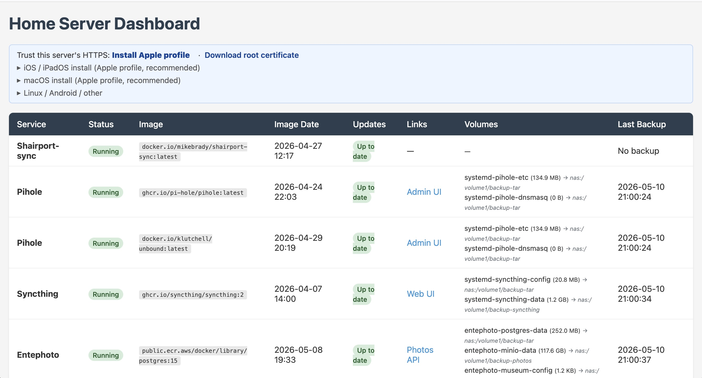

# Accelerate your journey to privacy and owning your data  Build your own private ecosystem.

> [!WARNING]
> **Work in progress — not ready for production use yet.**
> The project is under active development and as of now it's not
> exactly working as described. The architecture, role
> contracts, inventory layout, and even the deploy_services list
> still change without warning between commits.

## Objective

There are plenty of homeserver projects already. Why another one?

Because **the tools aren't the bottleneck — the transition is.**

Anyone who's tried to move off a vendor ecosystem (iCloud, Google
Photos, Apple Music, Dropbox, …) knows the pattern: dozens of viable
self-hosted alternatives in every category, each with its own setup,
backup shape, sync quirks, and migration story. Evaluating them takes
hours per app. Wiring half a dozen into a single coherent, daily-use
system takes weeks. Most people give up partway through and stay
locked in.

And to be fair: ecosystems like Apple's are genuinely good at "it
just works." That's why the *cost of leaving* feels so high — and why
the *cost of staying* (no real ownership of your own data, no leverage
when terms change) stays mostly invisible until it bites.

This project is one opinionated, end-to-end answer: a small,
well-chosen stack of self-hosted applications deployed together by a
single fully-automated install, with backup, restore, TLS, and a
unified dashboard already plumbed in. No "now wire these seven things
together yourself" steps.

**Today's audience.** Two groups, served by the same opinionated
stack:
- Technically inclined people who want real privacy and real control
  over their data, willing to spend a weekend (rather than a quarter)
  on the transition.
- Users who want to make the move, don't have the skills themselves,
  but are willing to pay a reasonable fee to an IT-services provider
  to deliver the same outcome.

**Where it's going.**
- Long-term, the IT-services role should be
  absorbable by an AI agent — guiding non-technical users through
  the move end-to-end and handing back a working setup. Today the
  human is in the loop; tomorrow the agent is.
- And obviously besides home users it could also serve the transition for
  small businesses, e.g. having the need to move away due to GDPR / US 
  cloud act or simply not satisfied with ecosystems like Office 365 and 
  looking for alternatives.

### Design principles

What "opinionated, end-to-end" means concretely:

- **Application focus**
  - A secure, private (ad- and tracker-filtered) home network for all family members
  - Host and own all personal data — documents, music, photos, videos
  - Seamless integration with the iOS ecosystem wherever practical (AirPlay, native photo sync, etc.)
- **Automation by default**
  - Fully automatic, declarative installation — one command, no clicking through wizards
  - Per-host configuration kept in a private overlay repository
- **Security-conscious design**
  - Unique credentials generated during initial install
  - Secrets stored encrypted at rest, never committed in plaintext
  - Rootless containers first — each rootless application runs as its own dedicated Linux user
  - Rootful containers only where rootless is not feasible, and always hardened
  - Caddy is the mandatory front door — every web UI reached via `https://<subdomain>.<caddy_domain>` with a single trusted internal CA; per-service HTTP ports are not exposed on the LAN
  - Use tailscale to create a virtual network accross your devices to be able to access services on your homeserver independent from your location and network access point
- **Operational consistency**
  - Fully automatic reinstall from scratch, including restore of configuration and data
  - All applications fully integrated with systemd (start, stop, reboot)
  - Simple but practical backup and restore of all your data
  - Automatic release updates of containers, plus automatic OS security updates on the host

---

## Alternatives & Comparison

Honest, side-by-side feature matrix. Contributions welcome — open
an issue or PR if your favourite solution is missing or a rating
looks off.

**Legend:** **+** delivered out of the box · **o** partial /
manual / requires extra setup · **−** absent or actively contrary

| Feature | **This project** | [**Coolify**](https://coolify.io) | [**Umbrel**](https://umbrel.com) | [**CasaOS**](https://casaos.io) | [**YunoHost**](https://yunohost.org) |
|---|:---:|:---:|:---:|:---:|:---:|
| Polished web UI for daily ops | o | + | + | + | + |
| Curated application catalog (one-click install) | o | + | + | + | + |
| Built-in SSO / LDAP across all installed apps | −  *(planned)* | − | − | − | + |
| Ready-made VPS image at common hosters | −  *(cloud-init self-provision planned)* | + | o | o | o |
| One-command install of the *whole* stack | + | o | + | + | + |
| Mandatory HTTPS for every service via internal CA | + | o | o | − | + |
| Tailscale / mesh-VPN integration first-class | + | o | + | o | − |
| **Rootless / per-app-user isolation by default** | + | − | − | − | o |
| Per-app systemd integration (`systemctl`, `journalctl`, dep ordering) | + | − | − | − | + |
| Automatic container/app release updates | + | − | − | − | o |
| Automatic OS security updates | + | − | o | o | + |
| Built-in scheduled backup workflow | + | − | + | − | + |
| Tested, fully automated restore from scratch | + | − | o | − | + |
| Zero control-plane RAM overhead on the home server | + | − | − | − | − |
| Easy to extend with services *outside* the catalog | + | + | − | + | o |
| Ready-made hardware appliance you can buy | − | − | + | o | − |

**Notes worth flagging:**

- **Rootless matters.** Coolify runs as root and so do all deployed containers — full rootless Docker is an [open feature request](https://github.com/coollabsio/coolify/issues/2387). The [Jan 2026 CVE batch](https://thehackernews.com/2026/01/coolify-discloses-11-critical-flaws.html) (3× CVSS 10.0, including unauthenticated root SSH key disclosure) demonstrates the cost of that default.
- **App-update model on Umbrel** is deliberately manual — apps don't auto-update so you can review each release. In practice [many apps lag well behind upstream](https://community.umbrel.com/t/umbrel-update-policy-many-apps-are-not-up-to-date/17208).
- **Lifecycle integration** — Coolify, Umbrel, and CasaOS all rely on Docker restart policies (`unless-stopped` etc.) for container lifecycle. No dependency ordering (e.g. wait for the NFS mount before starting Jellyfin), no per-app systemd unit, no `journalctl -u <app>`. Coolify's own control plane has had [host-reboot bugs](https://github.com/coollabsio/coolify/issues/5933).
- **Umbrel Bitcoin focus** — heavily oriented toward Bitcoin / Lightning use cases. Excellent if you want that; complexity tax if you don't.
- **CasaOS backup/restore** is an [open community feature request](https://github.com/IceWhaleTech/CasaOS/discussions/175), not a shipped capability. App updates are also limited — apps installed from the store are [bound to specific releases](https://github.com/IceWhaleTech/CasaOS/discussions/744).
- **YunoHost is fundamentally different** — apps are *not* containerized; they install directly into the host as system packages, each running as its own dedicated system user behind a shared NGINX + LDAP + SSO stack. That's why it gets credit for built-in SSO and per-app systemd integration but only `o` on isolation (no namespace boundaries), and why "extend outside the catalog" is harder (you'd be manually packaging an app into the YunoHost integration model).

---

## Technical Architecture

The target system is built around a small number of well-defined
components that together provide a predictable and maintainable
platform. It leverages **podman containers** (both rootless and
rootful) and **podman quadlets** for native systemd integration —
every application is wired into the host's boot and shutdown
sequence, scheduled container updates, and the backup flow.

<!-- Source: docs/diagrams/technical.d2 — render with `d2 docs/diagrams/technical.d2 docs/diagrams/technical.svg` -->

Backup flavours (driven by each role's `backup_manifest`):
- **tar** — small config/state volumes (`podman volume export` → gzip'd tar), restored atomically.
- **pgdump** — logical SQL dumps for PostgreSQL services (container stays up while the dump is taken).
- **rsync** — large mutable trees where a full-volume tar would be wasteful (media, MinIO buckets). A filesystem with snapshot capabilities on the NAS, like e.g. ZFS, is obviously benefitial.

The same system from an **automation perspective** — who does what,
and in which order, to bring a fresh box up to a fully-deployed
homeserver. The laptop as ansible host is optional, you could also use the homeserver itself:

<!-- Source: docs/diagrams/automation.d2 — render with `d2 docs/diagrams/automation.d2 docs/diagrams/automation.svg` -->

Use **Tailscale** to create a **virtual network across your devices and the homeserver** to be able to access the services running on homeserver, independent from the location and network access point your device is connected. NAS server can be omittet but still needs network access to the homeserver for backup und restore operations.

<!-- Source: docs/diagrams/tailscale.d2 — render with `d2 docs/diagrams/tailscale.d2 docs/diagrams/tailscale.svg` -->

---

### 1. Base Operating System – AlmaLinux 9

AlmaLinux 9 is used as the foundational operating system due to:
- A long, predictable lifecycle (10 years per major release)
  with no surprise feature churn between minor versions
- Bug-for-bug compatibility with RHEL — every operational pattern,
  package, and SELinux policy translates directly
- Strong SELinux integration out of the box
- Mature container tooling — **podman ≥ 5** with native systemd
  **quadlet** unit support and rootless containers, shipped in stock
  `appstream` from AL 9.4 onward (no third-party COPR required)
- **nfs-utils** in stock `baseos` — every host gets the
  `mount.nfs` helper needed for the NAS-backed media (jellyfin) and
  backup/restore flows
- Free and community-governed, with no commercial subscription
  required

This choice ensures the system remains **secure, current, and aligned
with enterprise Linux best practices**, while still being suitable for
home use — and avoids the ~13-month Fedora release treadmill on a
machine that should "just work" for years.

---

### 2. Configuration Management – Ansible

All post-installation configuration is handled using **Ansible**, ensuring the system converges into a known desired state.

Ansible is responsible for:
- System configuration and hardening
- User and group management
- Container runtime setup
- Service configuration and lifecycle management

This approach treats the system as **infrastructure as code**, enabling version control, review, and repeatable execution.

---

### 3. Container-First Workload Model

All applications and services are deployed as containers using two complementary execution models.

#### Rootful Containers
Used for:
- Infrastructure-level services
- Networking-sensitive workloads
- Services requiring elevated privileges

#### Rootless Containers
Used for:
- User-scoped services
- Isolated application stacks
- Improved security through least-privilege execution

Each container deployment is:
- Fully automated via Ansible
- Declarative and reproducible
- Independent of manual user interaction

Persistent data is stored in explicitly defined volumes, allowing:
- Clean separation between OS and application data
- Straightforward backup and restore processes

---

## Non-Goals

The following items are explicitly **out of scope** for this project:

- Running a general-purpose desktop environment on the server
- Manual, ad-hoc configuration changes on the host system
- Hosting production-grade, high-availability workloads
- Complex multi-node orchestration platforms (e.g. Kubernetes)
- Cloud-specific tooling or managed services dependencies
- Long-term in-place OS upgrades without reprovisioning

The guiding principle is **rebuild over repair**: if the system drifts, it should be reinstalled and redeployed automatically rather than manually fixed.

---

## Getting Started

If you want to get up and running quickly, head straight to the
**[Quickstart guide](docs/Quickstart.md)** — it walks through the
fresh-install path end-to-end (cloud-init bootstrap, private overlay
setup, vault, and first deploy).

Once deployed, install the homeserver's internal CA on each device
that wants to reach the web UIs — visit
`http://<caddy_domain>/trust` (plain HTTP, no warning) for download
links and per-platform install instructions.

A more detailed setup reference will land here in a follow-up
revision.

---

## Services

Platform foundations (always deployed) — `os-base` (system hardening,
podman 5, dnf-automatic, systemd-resolved, swap, etc.) and
`os-tailscale` (mesh-VPN onto the tailnet, optional subnet routing).
These aren't web-facing services; they set the stage so the
application roles below can run.

### Deployed

| Service | Purpose | Container images | Volumes (backup method) |
|---|---|---|---|
| **Dashboard** | Generated status page showing every deployed service, its container, related volumes and last backup time. | — (static HTML rendered on host) | — |
| **Caddy** | Mandatory front-door reverse proxy. Issues TLS for every web UI from a single internal CA seeded from the private overlay. | `public.ecr.aws/docker/library/caddy:latest` | <ul><li>`caddy-data` — internal CA seeded from private overlay (not backed up)</li><li>`caddy-config` — not backed up</li><li>`caddy-etc` — not backed up</li></ul> |
| **Pi-hole + Unbound** | Network-wide DNS ad/tracker blocking with a local recursive resolver (no upstream DNS leakage). Admin UI at `https://pihole.<caddy_domain>`. | <ul><li>`ghcr.io/pi-hole/pihole:latest`</li><li>`docker.io/klutchell/unbound:latest`</li></ul> | <ul><li>`pihole-etc` — tar</li><li>`pihole-dnsmasq` — tar</li></ul> |
| **Shairport-sync** | AirPlay audio receiver for iOS/macOS devices. | `docker.io/mikebrady/shairport-sync` | — (stateless) |
| **Syncthing** | Peer-to-peer file synchronization between household devices. | `ghcr.io/syncthing/syncthing:2` | <ul><li>`syncthing-config` — tar</li><li>`syncthing-data` — rsync</li></ul> |
| **Music Assistant** | Self-hosted music server with library + streaming providers + queue. SqueezeLite player container drives a USB DAC for local playback (opt-out via `music_assistant_player_enabled: false` on hosts without audio hardware). | <ul><li>`ghcr.io/music-assistant/server:latest`</li><li>`docker.io/giof71/squeezelite`</li></ul> | <ul><li>`music-assistant-data` — tar</li></ul> |
| **Ente Photos** | Self-hosted photo & video library with iOS/Android apps (end-to-end encrypted). | <ul><li>`ghcr.io/ente-io/server:latest`</li><li>`ghcr.io/ente-io/web:latest`</li><li>`public.ecr.aws/docker/library/postgres:15`</li><li>`quay.io/minio/minio:latest`</li></ul> | <ul><li>`entephoto-museum-config` — tar</li><li>`entephoto-minio-data` — rsync</li><li>`ente_db` (Postgres) — pgdump</li></ul> |
| **Paperless-NGX** | Document management with OCR + full-text search. Optional SFTP sidecar for scanner auto-ingest (`paperless_sftp_ingest_enabled`). | <ul><li>`ghcr.io/paperless-ngx/paperless-ngx:latest`</li><li>`public.ecr.aws/docker/library/postgres:16`</li><li>`public.ecr.aws/docker/library/redis:7-alpine`</li><li>`docker.io/gotenberg/gotenberg:8`</li><li>`docker.io/atmoz/sftp:latest`</li></ul> | <ul><li>`paperless-data` — tar</li><li>`paperless-export` — tar</li><li>`paperless-redis-data` — tar</li><li>`paperless-media` — rsync</li><li>`paperless` (Postgres) — pgdump</li><li>`paperless-consume`, `paperless-sftp-*` — runtime, not backed up</li></ul> |
| **Jellyfin** | Media server for movies, TV and music with native iOS/tvOS clients. NAS-backed video library mounted read-only via NFS. | `ghcr.io/jellyfin/jellyfin:latest` | <ul><li>`jellyfin-config` — tar</li><li>`jellyfin-media` — rsync (opt-in restore)</li></ul> |
| **Backup** | Host-side service. Snapshots each role's declared volumes to the NAS on a schedule (default 21:00) using the per-role `backup_manifest`. | — (no container — runs as a systemd timer) | — |

The dashboard, generated on the host and served by Caddy, gives you a
single page with status / images / volumes / last-backup time for
every deployed service:

### Planned applications / features
- [Nextcloud (file storage and sharing)](https://github.com/luckynrslevin/home-server/issues/7)
- [Single Sign-On (e.g. Keycloak) across all installed apps](https://github.com/luckynrslevin/home-server/issues/6)
- [Cloud-init self-provisioning — one-paste deploy to any VPS provider](https://github.com/luckynrslevin/home-server/issues/106)
- [Home Assistant](https://www.home-assistant.io/)
- [Mealie](https://mealie.io/)
- IoT stack (Mosquitto, InfluxDB, Grafana, Telegraf)
- [Uptime Kuma](https://uptimekuma.org/)
